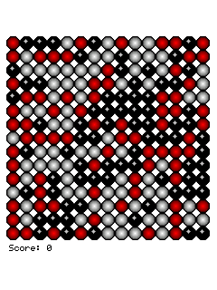
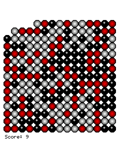

# Bubbles for Pocket PC — Windows Mobile proof

## Diagnosis and fix

The supplied CAB installs `Bubbles.exe` (legacy ARM, 5 PE sections, 110 imports). Its first window installs a 20-byte ARM WndProc thunk at `0x5fffff74` on the guest stack. The game calls `FlushInstructionCache` before registering that thunk with `SetWindowLongW`; PocketHLE previously had no handler for the cache flush, while Unicorn kept the stack page non-executable. The baseline therefore stopped with `FETCH_PROT` and `frame_counter=0` before the first paint.

The CPU now promotes only the requested guest page while preserving its read/write rights, invalidates the corresponding translation cache, and safely retries a first fetch outside the Unicorn callback. Stack and heap pages are not made executable globally.

A second startup issue was an AYGSHELL ordinal collision: the shared Pocket PC 2003 table names ordinal 34 `SHRecognizeGesture`, but this Bubbles build passes a 32-byte menu-bar structure (`cbSize=32`, parent `FAKE_HWND`, toolbar ID 100) and reads `hwndMB` at `+0x1c`. PocketHLE now recognizes that exact legacy call shape and returns a usable fake menu-bar HWND, without changing ordinary gesture calls.

## Visual and interaction check

Compared with the supplied PDA screenshots, the 240×320 game framebuffer now reaches the moderate 15×15, three-colour board with the `Score: 0` label. Two scheduled taps remove bubbles and update the score to 9.

PocketHLE captures the app framebuffer, not the Windows CE shell. The purple status/title bar and bottom File/softkey command bar in the reference photos are OS chrome and are not drawn by this high-level emulator; the game client area, bubbles, and score are shown below.

## Tests

- `cargo fmt --all -- --check` — passed.
- `cargo test --workspace` — 414 passed, 10 ignored, 0 failed.
- `cargo clippy --workspace --all-targets` — passed.
- `tools/ai-tap-sequence.py` with `--message-budget 0`, 240×320, and no taps — emulator exited cleanly at `frame_counter=1982` after rendering the board.
- `tools/ai-tap-sequence.py` with taps `500:44,47` and `1000:14,47` — both press/move/release sequences were delivered; emulator exited cleanly at `frame_counter=3177`, with `Score: 9`.

The emulator host has no default ALSA output device, so audio was unavailable during the run. These are PocketHLE Unicorn-emulator results; no physical Windows Mobile device was used.
