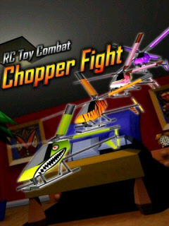
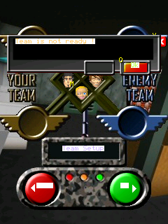

# Chopper Fight 1.1 — Windows Mobile

## Fixes

The CAB's CE install header puts the executable in `bin/`, resources in `resources/`, and the manual in `manual/`. PocketHLE previously flattened that tree, missed sibling resource paths containing `..`, and didn't expand nested ZIPs in their installed directories. The game also relies on accurate class registration results, live GDI queries and text, a Windows CE display DC, and the correct button-release message state.

## Verification

- `tools/ai-tap-sequence.py` completed with exit code 0; emulator reported `Emulator exited cleanly` and `frame_counter=2385`.
- Captured title and team-selection screens are below. This sequence reaches the selection UI; it does **not** yet demonstrate a combat round.
- `cargo fmt --all -- --check` — passed.
- `CARGO_BUILD_JOBS=1 cargo test -p pocket-cab -p pocket-kernel -p pocket-winceapi -p pocket-cli` — **115 passed, 0 failed**.
- `cargo test --workspace` was attempted, but the runner was killed with exit code 137 before completing; the affected crates passed in the serialized targeted run above.

## Screenshots

### Title

### Team selection

