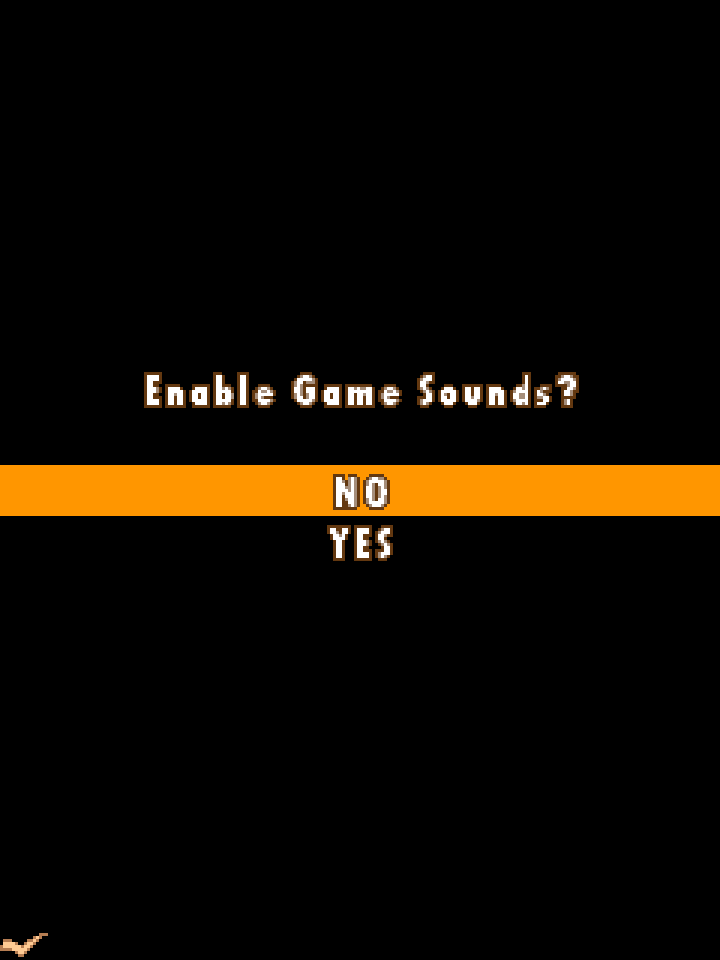
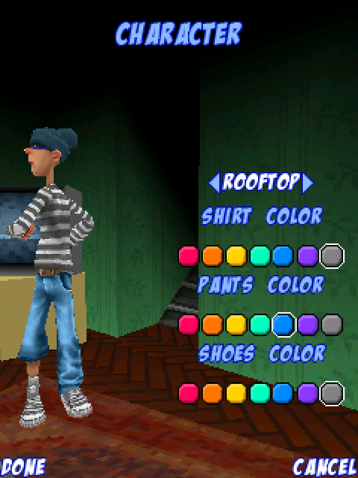
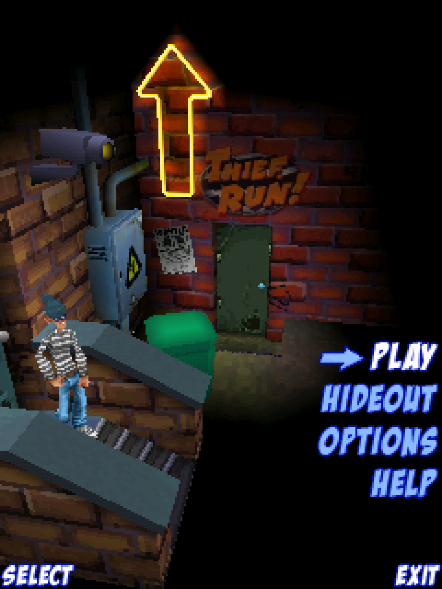
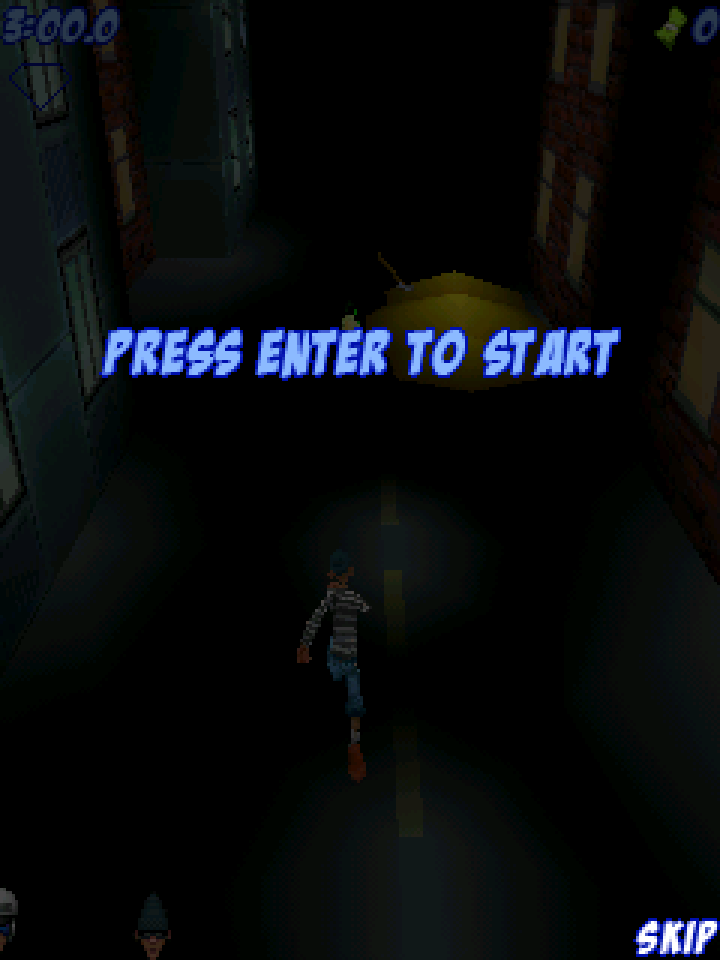
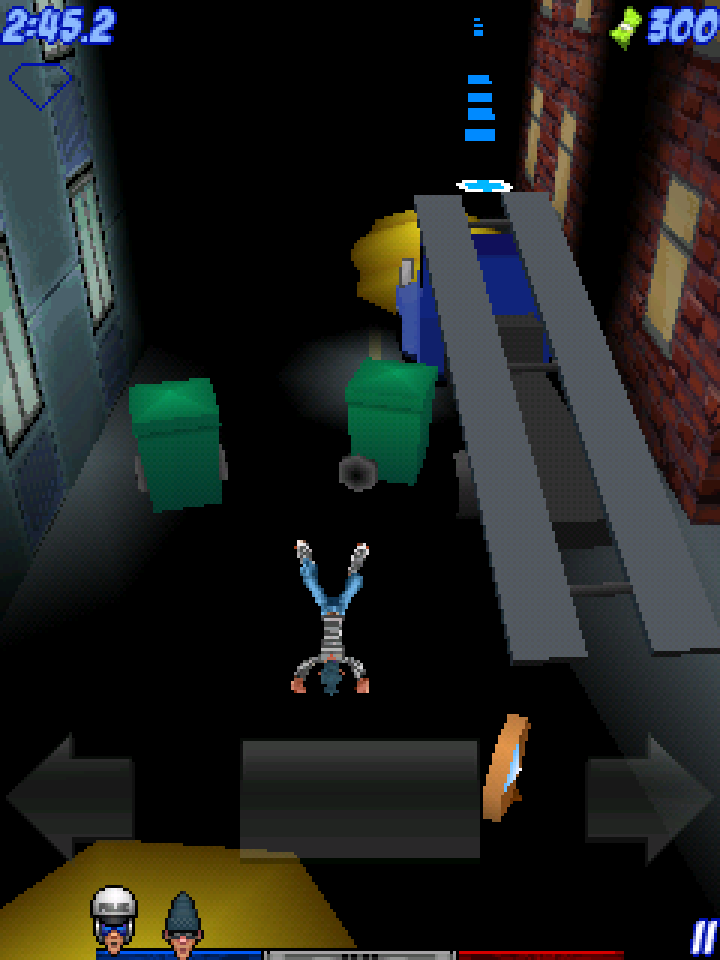
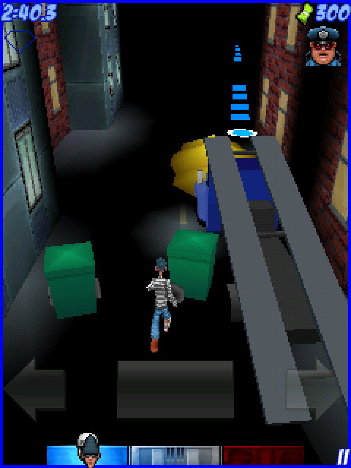
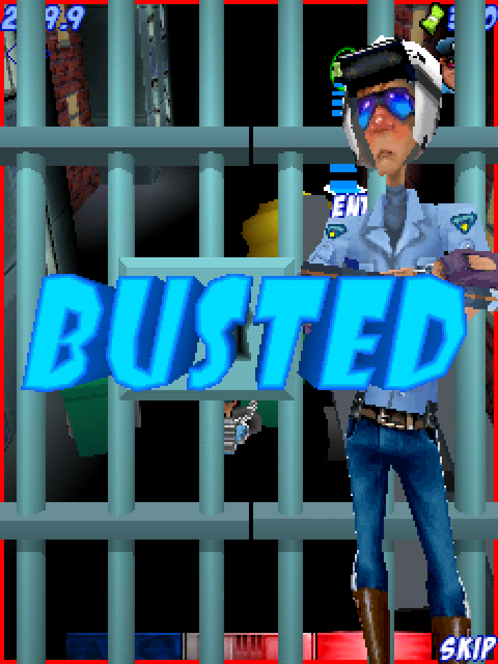

# Cops & Robbers — Windows Mobile startup and gameplay proof

## Diagnosis

The supplied RAR contains `QVGA/Cops_RobbersQVga.cab`, which installs the ARM Thumb build `copsrobbers.exe`. With PocketHLE's legacy CLI budget of 240 synthetic window messages, the game renders its sound-choice prompt and then exits cleanly with `WM_QUIT` before reaching its menu: the baseline ends at `frame_counter=1`, with guest exit code `0x42`. This is not a DirectDraw/GAPI presentation failure—the first frame is visible. Windows CE's `GetMessage` contract returns zero for `WM_QUIT`, and its documentation says the normal message loop exits in response.

The GLU startup and menu flow need more than 240 messages. The CLI now selects an unlimited message budget by default when the Cops & Robbers archive/module path is detected. Explicit `--message-budget` values still override this, and all other games retain the bounded 240-message default. The tap helper no longer forces `240` when the option is omitted. Its frame-scheduled inputs also stay queued for later screens instead of consuming a far-future menu action on the static sound prompt.

## Acceptance run

The included CAB was run with PocketHLE's ARM Unicorn backend using `tools/ai-tap-sequence.py`. The initial tap accepts the sound prompt; the later Enter events advance through the title flow and start the level. `--message-budget` is intentionally omitted so the game-specific default is exercised.

```text
python3 tools/ai-tap-sequence.py /path/to/Cops_RobbersQVga.cab \
  --pockethle target/release/pockethle \
  --cpu unicorn \
  --max-slices 12000000 \
  --instructions-per-slice 1000000 \
  --tap 1:120,165 \
  --key 700:enter \
  --key 900:enter \
  --key 1200:enter \
  --key 1700:enter \
  --key 2000:enter \
  --dump-frames-to /tmp/cops-and-robbers-frames \
  --dump-frame-stride 50 \
  --max-frames 48
```

**Result: PASS.** The CLI reported `Synthetic message budget: 0 (0 = unlimited)`, delivered the scheduled presses at frames 700, 900, 1200, 1700, and 2000, and captured 48 changed frames at 240×320. Active gameplay is visible in captures 40 and 42; the timer, score, character sprite, street obstacles, and on-screen controls are present. The final framebuffer reached `frame_counter=2353`; the run stopped at the requested frame-capture limit with exit status 0. No unimplemented API calls occurred in the successful run.

The capped reproduction was also run with explicit `--message-budget 240`: it exited through `WM_QUIT` with `R0=0x00000042` and `frame_counter=1`, matching the original failure. That artificial shutdown logs a non-fatal `UnregisterClassW` warning during teardown.

## Build and tests

- `cargo build --release -p pocket-cli --features unicorn` — passed.
- `cargo test --workspace` — **391 passed, 10 ignored, 0 failed**.
- `cargo clippy --workspace --all-targets` — passed.
- `cargo fmt --all -- --check` — passed.
- `python3 -m py_compile tools/ai-tap-sequence.py` and helper `--dry-run` checks (default plus explicit budget) — passed.

Detailed outcomes: [test results](logs/test-results.md).

The host has no ALSA output device, so PocketHLE runs silently and logs the expected audio-device warning; this does not affect rendering or input. Verification is from PocketHLE's ARM Unicorn emulator on Linux, not a physical Windows Mobile handset.

## Screenshots

The captures are native 240×320 frames enlarged 3× with nearest-neighbour scaling for readability.

| Screen | Capture |
| --- | --- |
| Capped startup before the fix |  |
| Character selection |  |
| Main menu |  |
| Level start prompt |  |
| Active gameplay |  |
| Later gameplay frame |  |
| End-of-run overlay |  |

## References checked

- [Microsoft Learn: `GetMessage` (Windows CE 5.0)](https://learn.microsoft.com/en-us/previous-versions/windows/embedded/aa453135(v=msdn.10)) — return value and `WM_QUIT` message-loop behavior.
- [Microsoft Learn: `PostQuitMessage` (Windows CE 5.0)](https://learn.microsoft.com/en-us/previous-versions/windows/embedded/ms911938(v=msdn.10)) — `WM_QUIT` requests thread termination.
- [GitHub code search: `GXOpenDisplay`](https://github.com/search?q=GXOpenDisplay&type=code), including [the XNP2 Windows CE GAPI header](https://github.com/nonakap/xnp2/blob/master/wince/gx/gx.h) and [SRB2's GAPI compatibility layer](https://github.com/Rinnegatamante/srb2-vita/blob/master/src/win32ce/gapi_c.cpp). These references were used to cross-check initialization and `GXBeginDraw` / `GXEndDraw`; no rendering API change was needed because the existing DirectDraw/GAPI paths already produced the visible frames.
