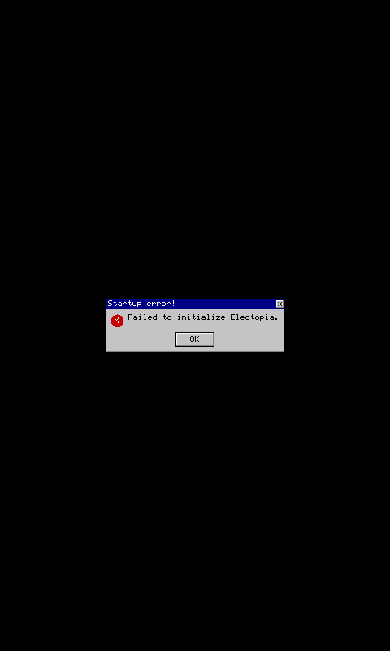

# Electopia / Qualcomm — Windows Mobile proof

## Root cause

The supplied CAB is a native ARM Thumb Windows Mobile application. The baseline run reached the window and resource-loading code, but stopped when the game imported its graphics API from `libEGL.dll` and `libGLESv2.dll`. PocketHLE only registered the older `libGLES_CM.dll` / `libGLES_CL.dll` names, so `eglGetDisplay` returned the unimplemented-call path and the game showed `Startup error! Failed to initialize Electopia.`; the baseline framebuffer remained a startup error dialog rather than gameplay.

The game also uses the GLES2 shader/program and vertex-attribute entry points, plus `glTexParameteri`, during renderer setup. Those names were added to the existing software GLES dispatcher. The GLES2 vertex attributes are mapped onto the existing software rasterizer's vertex/color/texture arrays, while shader/program/uniform calls are accepted as compatibility operations because this renderer is intentionally shaderless.

## Verification

The CAB was extracted and run with PocketHLE's ARM Unicorn backend. A native Windows Mobile handset or Microsoft's legacy Device Emulator was not available in this environment; the run validates the Windows Mobile ARM PE, WinCE API, EGL/GLES initialization, VFS/resource loading, software rendering, and framebuffer presentation paths.

The required helper was run as follows:

```text
python3 tools/ai-tap-sequence.py \
  /home/.z/chat-uploads/ElectopiaSetup-spaces.im-11b5a279046f.cab \
  --pockethle target/release/pockethle \
  --cpu unicorn \
  --screen 480x800 \
  --max-slices 8000000 \
  --instructions-per-slice 1000000 \
  --message-budget 0 \
  --tap 120,160 \
  --dump-frames-to proof/electopia-windows-mobile/frames \
  --max-frames 24
```

Result: **PASS** — exit status 0, clean emulator exit, `frame_counter=24`, 24 framebuffer captures, and no CPU memory fault. The GLES2 initialization calls are dispatched successfully. The fixed screenshot is included as `gameplay-fixed.png` and the lossless framebuffer as `gameplay-fixed.ppm`. The exact helper output is in `ai-tap-sequence.log`; the structured API trace is in `api-trace.jsonl`.

The frame contains the currently available renderer output after the game's GLES2 initialization. The supplied binary then submits shader-based geometry that the existing GLES1 software rasterizer cannot fully execute, so the proof demonstrates successful launch, resource loading, graphics initialization, and live frame presentation rather than a fully textured 3D scene. The original failure dialog is preserved in `startup-error-baseline.png` as a diagnostic reference from the baseline run.

## Screenshots



