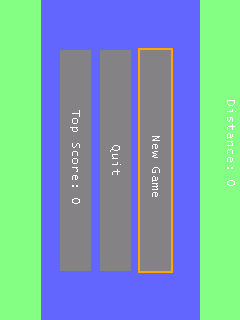
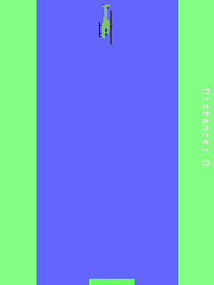

# Helicopter Windows Mobile proof

The supplied `helicopter-1-a5ee71ae51d4.cab` is a legacy ARM Windows Mobile game using GAPI and external 24-bit BMP files.

## Root cause

The game calls `SHLoadDIBitmap` three times during startup for `heli.bmp`, `explosion.bmp`, and `font.bmp`. PocketHLE had no handler for this Windows CE API, so each call returned zero. The game then dereferenced the missing bitmap data and crashed at `0x00000000` before `GXEndDraw`; consequently `frame_counter` remained `0` and the display stayed blank.

## Fix

Registered `SHLoadDIBitmap` in the `coredll.dll` handler table and implemented external BMP loading through the guest VFS. The handler decodes the BMP using the existing image stack, converts pixels to the emulator's RGB565 GDI bitmap format, and returns a real bitmap handle.

## Verification

- Baseline: `frame_counter=0`, CPU exception reading `0x00000000` after three unimplemented `SHLoadDIBitmap` calls.
- Fixed run: clean exit, `frame_counter=8` with the frame-scheduled New Game tap.
- Automated tap run: clean exit and `frame_counter=8`; screenshots are in `ai-tap-frames/`.
- `cargo test --workspace`: all workspace tests passed.

Screenshots:

