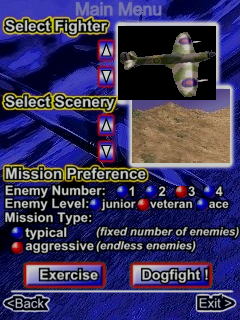

# Mini-Dogfight 1.5 — Windows Mobile

## Result

The supplied CAB now opens the single-player setup screen at 240×320. The CAB itself is not included in this repository.

## Verification status

This image shows the setup screen, **not gameplay**. The emulator run reached the `max_slices=100000` limit at `frame_counter=48`; the transition from the Dogfight button into a flight scene is not verified. This pull request is therefore a draft.

## Repository checks

- `cargo fmt --all -- --check` — passed.
- `cargo test --workspace` — passed.
- `cargo clippy --workspace --all-targets` — passed.
- `cargo build --release -p pocket-cli --features unicorn` — passed.

