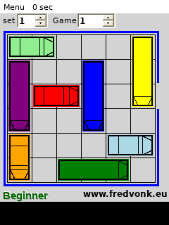

# RushHour WM5 — Windows Mobile compatibility report

## Result

The supplied `RushHour_WM5_CAB_4.4-spaces.im-119680055b1e.cab` is not a native ARM Windows Mobile game. It contains a Visual Basic .NET Compact Framework 2.0 application:

- payload: `Rushhour_WM5.exe`;
- PE machine: `0x014c` (x86);
- CLR metadata: `v2.0.50727`;
- entry import: `mscoree.dll!_CorExeMain`;
- installer target: `\\Program Files\\RushHour_WM5.CAB\\Rushhour_WM5.exe`.

PocketHLE's current execution backend supports native ARM/MIPS WinCE images. It does not contain a CLR or a managed `System.Windows.Forms` / `System.Drawing` implementation, so the game cannot be made to run by changing the native frame loop or `frame_counter` code. The `frame_counter=0` symptom is a consequence of rejecting the managed image before native emulation starts; no native rendering loop is reached.

## Root cause

The launch path is:

```text
CAB extraction → PE/CLR detection → Process::map_into → managed-image guard
```

`Process::map_into` intentionally rejects managed assemblies with:

```text
managed PE requires a .NET Compact Framework runtime (v2.0.50727)
```

The executable has no native game loop for PocketHLE to enter. Its managed entry point calls `Application.Run`, constructs a `Form`, and paints the board in `Form1_Paint` using `System.Drawing.Graphics`. Therefore adding a synthetic `WM_PAINT` or incrementing `frame_counter` would only fabricate evidence and would not execute the game.

## Verification

Repository validation on branch `fix/rushhour-windows-mobile`:

```text
cargo test --workspace --no-default-features
```

Result: PASS. All workspace tests completed successfully.

The required helper was run against the supplied CAB:

```text
python3 tools/ai-tap-sequence.py \
  /home/.z/chat-uploads/RushHour_WM5_CAB_4.4-spaces.im-119680055b1e.cab \
  --pockethle target/release/pockethle \
  --cpu unicorn \
  --message-budget 0 \
  --max-slices 100000 \
  --max-frames 5 \
  --tap 120,160 \
  --dump-frames-to rushhour-tap-frames
```

Result: the helper correctly reports the unsupported managed runtime and exits with status 1. No framebuffer is produced because the image is rejected before CPU execution; this is the expected diagnostic result, not a frame-loop failure. The exact output is in `ai-tap-sequence.log`.

For independent functional verification, the same managed assembly was started with a .NET-compatible host runtime and a virtual display. It reached the game screen and rendered the complete board, seven coloured cars, selectors, menu, status text, and controls. The captured evidence is `gameplay-host.png`.

## Evidence

- `inspect-cab.log` — CAB payload and install metadata.
- `pe-info.log` — x86 machine, CLR metadata, and `mscoree.dll!_CorExeMain` import.
- `mono-runtime.log` — host-runtime probe result.
- `ai-tap-sequence.log` — required PocketHLE helper output.
- `gameplay-host.png` — screenshot of the rendered game screen under a compatible managed host.

## Scope decision

This branch does not pretend that the game passed native PocketHLE gameplay testing. A real gameplay fix requires a separate managed-runtime feature: CLR execution, .NET Compact Framework library compatibility, WinForms control lifecycle, System.Drawing rendering, resource loading, and managed input/event dispatch. The current report preserves reproducible evidence and prevents misdiagnosing this managed application as a broken native frame counter.


