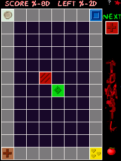

# Tomatl gameplay proof

The supplied `tomatl.arm-c62e857ad2de.CAB (1)` reaches the Tomatl board and accepts a scheduled stylus tap under PocketHLE.

## Reproduction

```text
cargo run -p pocket-cli --features unicorn -- run "tomatl.arm-c62e857ad2de.CAB (1)" --cpu unicorn --max-slices 3000 --message-budget 0 --dump-frames-to proof/tomatl/run --max-frames 3 --tap 3:120,160
```

The capture reached `GXOpenDisplay`, produced three framebuffer snapshots, and the final snapshot shows the game board with score, remaining pieces, controls, and the bomb indicator.


