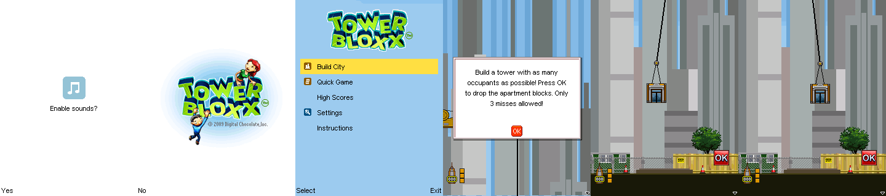
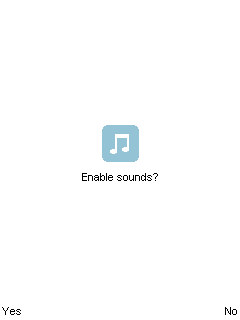
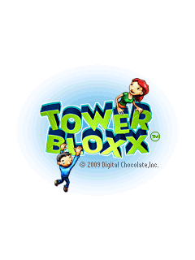
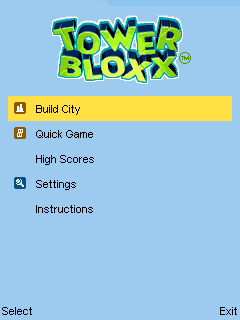
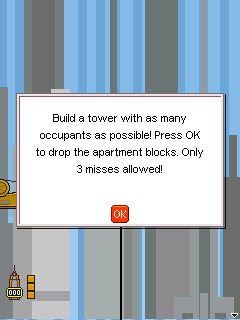
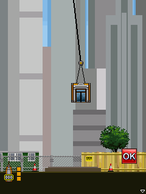

# Tower Bloxx (Digital Chocolate) — Windows Mobile

Reproducible proof for the DirectDraw vtable fix in
`crates/pocket-winceapi/src/ddraw.rs`.

Archive: `tower-bloxx-e101-retail-pantamorph.cab` → `\Program
Files\TowerBloxx\TBX.exe`, ARMv4T PE32, Windows CE 5.01, imports
`DDRAW.dll!DirectDrawCreate` plus `COREDLL`, `ole32` and `AYGSHELL` by
ordinal.

## Before

```
$ pockethle -v run tower-bloxx.cab --cpu unicorn --message-budget 0
ERROR pocket_kernel] cpu crashed: EXCEPTION (READ unmapped) at guest address 0x00000000
  current pc=0x00088d58   ; ldr r3, [r0] with r0 = 0
                          ; then  ldr pc, [r3, #0x1c]  — clipper vtable slot 7
Final framebuffer snapshot written to /tmp/pockethle-final.ppm (frame_counter=0)
Error: main emulator loop
```

`IDirectDraw::CreateClipper` is slot 3 on Windows CE and slot 4 on the
desktop, so the call ran `Compact`, the clipper out-parameter was never
written, and `clipper->lpVtbl->SetHWnd` dereferenced NULL.

## After

```
$ python3 tools/ai-tap-sequence.py tower-bloxx.cab \
    --cpu unicorn --message-budget 0 --max-slices 40000000 \
    --tap 2:20,310 --tap 4:120,160 --tap 6:120,160 \
    --tap 8:120,133 --tap 11:120,133 --tap 14:20,310 \
    --tap 28:120,213 --tap 34:120,213 --tap 45:120,213 --tap 60:120,213 \
    --dump-frames-to /tmp/tbx --max-frames 90

CAB tower-bloxx.cab -> TBX.exe (Digital Chocolate / TowerBloxx)
Loaded TBX.exe (ARM Thumb machine), 5 sections, 158 imports
Scheduled synthetic tap at (20,310) for frame 2
... 10 taps scheduled ...
WARN pocket_winceapi] unimplemented call -> COREDLL.dll!Shell_NotifyIcon
Final framebuffer snapshot written to /tmp/pockethle-final.ppm (frame_counter=90)
Emulator exited cleanly.
```

90 distinct frames, no fault, clean exit. The one remaining warning is
`Shell_NotifyIcon`, a tray call the game does not depend on.

Tap coordinates, in guest 240x320 space:

| Frame | Tap | Screen it answers |
| --- | --- | --- |
| 2 | 20,310 | "Yes" softkey on **Enable sounds?** |
| 4, 6 | 120,160 | skip the publisher logo and the title card |
| 8, 11 | 120,133 | **Quick Game** in the main menu |
| 14 | 20,310 | "Select" softkey |
| 28+ | 120,213 | **OK** on the tutorial popup, then drop blocks |

## Frames



| | |
| --- | --- |
|  |  |
|  |  |
|  |  |

`06-gameplay.png` is the playable state: the city backdrop, the crane
swinging an apartment block on its cable, the hoarding, the tree, the
traffic cones, the miss counter and the OK button all draw correctly.
